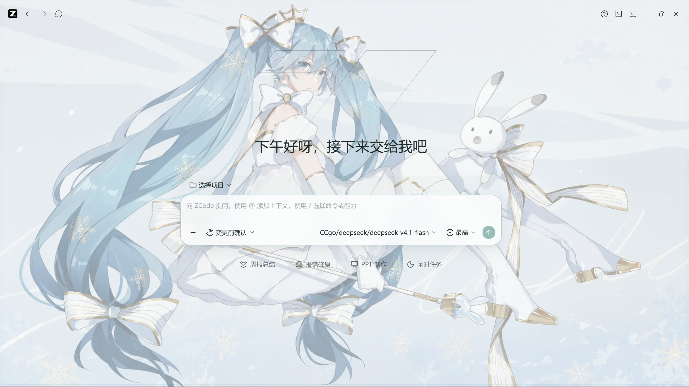
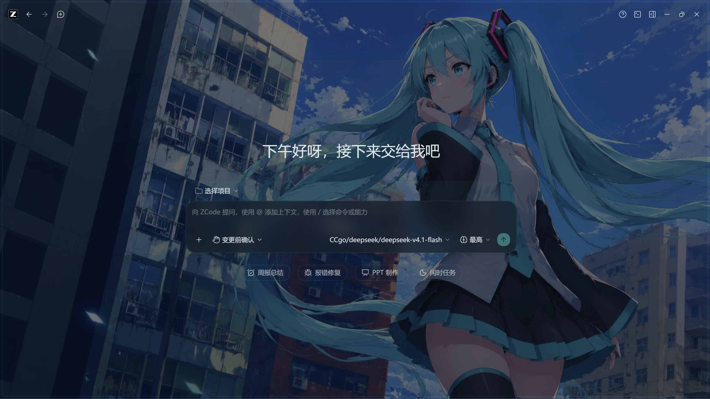

# zcode-skin

一款为 [ZCode](https://github.com/zai-org/ZCode) 桌面版打造的皮肤主题，以初音未来（Hatsune Miku）为设计灵感，提供 **亮色** 与 **暗色** 两套完整主题。

皮肤采用 **CSS 变量覆盖** 实现：全量映射 ZCode 前端的 110+ 个 `--color-*` 设计令牌（含终端 xterm 16 色、git 状态色、diff 色、图表色），并附带两套主题壁纸、磨砂玻璃面板、全局圆角放大与丝滑的亮暗切换过渡。跟随 ZCode 设置中自带的亮 / 暗主题切换自动换装。

## ✨ 主题一览

| 主题 | 对应 ZCode 模式 | 风格 |
| ---- | ---- | ---- |
| Snow Miku（初音 · 亮） | 浅色 | 雪白 × 冰蓝 × 沉稳 Teal `#0F9D8E` |
| Cyber Diva（初音 · 暗） | 深色 | 深夜蓝黑基底 × 霓虹 Miku Teal `#39C5BB` |

## 🖼 效果图

**Snow Miku（亮色主题）** —— 雪 Miku 壁纸透过磨砂面板隐约可见，雪白冰蓝配色清爽通透：



**Cyber Diva（暗色主题）** —— 深夜蓝黑 × 霓虹 Teal，状态行、思考行与代码胶囊均有青色点缀，沉浸专注：



## 📦 使用方法

### 安装

1. 将本仓库克隆到本地：

   ```powershell
   git clone https://github.com/cainiao0502/zcode-skin.git
   ```

2. 环境要求：Windows + 已安装 [Node.js](https://nodejs.org/)（脚本通过 npx 调用 `@electron/asar` 重打包资源）。

3. **完全退出 ZCode**——注意 ZCode 默认"关闭时最小化到托盘"，请在托盘图标右键退出，确保进程完全结束。

### 应用

 4. **双击 `apply-skin.bat`**（推荐——Windows 默认禁止直接运行 .ps1，bat 启动器已自动绕过且窗口不会闪退），或在终端运行：
 
    ```powershell
    .\apply-skin.bat
    # 或
    powershell -ExecutionPolicy Bypass -File .\apply-skin.ps1
    ```
 
    脚本会自动备份原版 `app.asar`、解包、注入皮肤、重打包并校验，约 1-2 分钟。默认 ZCode 安装在 `D:\ZCode`，其他位置用 `.\apply-skin.bat "C:\Program Files\ZCode"` 传入。
 
 5. 启动 ZCode，在 **设置 → 外观 → 界面主题** 选择 浅色 / 深色，即可看到 Snow Miku / Cyber Diva 双主题。
 
 ### 还原
 
 双击 `restore-skin.bat`，或：
 
 ```powershell
 .\restore-skin.bat
 ```

## 🔄 更新后重新应用

ZCode **自动更新会覆盖 app.asar，皮肤随之丢失**（不会损坏任何文件）。更新完成后，退出 ZCode 并重新运行 `apply-skin.ps1` 即可——脚本会动态定位新版样式文件，小版本更新无需改动。

## 📁 目录结构

```
zcode-skin/
├── miku-skin.css        # 皮肤本体：令牌覆盖 + 壁纸 + 圆角 + 动效
├── apply-skin.ps1       # 一键应用（幂等，可重复执行）
├── restore-skin.ps1     # 一键还原原版
├── assets/              # 主题壁纸（已 base64 内嵌进 CSS，此处供再生成用）
└── docs/                # 效果图
```

## 🔍 实现原理

ZCode 的插件系统只支持 skills / commands / hooks / MCP，**没有 UI 主题组件**，因此本皮肤采用 **app.asar 补丁**方式：

1. 解包 `resources/app.asar`，定位渲染层主样式文件 `out/renderer/assets/styles-*.css`；
2. 在 CSS 末尾追加皮肤块——以更高优先级选择器覆盖 `--color-*` 语义令牌、`--radius-*` 圆角令牌与 body 壁纸层（带标记注释，幂等可重复应用）；
3. 重打包并原位替换（原生二进制保持 unpacked，逐文件校验）。

皮肤内容：约 110 个语义令牌全量映射、双主题壁纸（base64 内嵌）、主面板 12% 超透磨砂、侧栏横向渐变纱、代码块/终端/测试结果卡 Teal 化、思考与工具摘要行青色点缀、圆角全局圆润化、亮暗切换 0.2s~0.28s 平滑过渡。

> Mermaid 图表、shiki 代码高亮、PPTX 内容色为 JS 内联样式，CSS 无法覆盖，属预期范围外。

## ⚠️ 免责声明 / Disclaimer

本项目中的壁纸及图片素材均来自网络，仅用于学习和个人美化用途，版权归原作者所有。如有侵权，请通过 [Issues](https://github.com/cainiao0502/zcode-skin/issues) 联系，会第一时间删除。

All wallpapers and image assets in this project are collected from the Internet and are for learning and personal customization purposes only. Copyright belongs to the original authors. If any content infringes your rights, please open an issue and it will be removed immediately.

本皮肤与 ZCode / Z.ai 官方无关。初音未来（Hatsune Miku）相关形象版权属于 Crypton Future Media, INC.

## 📄 License

[MIT](LICENSE)
